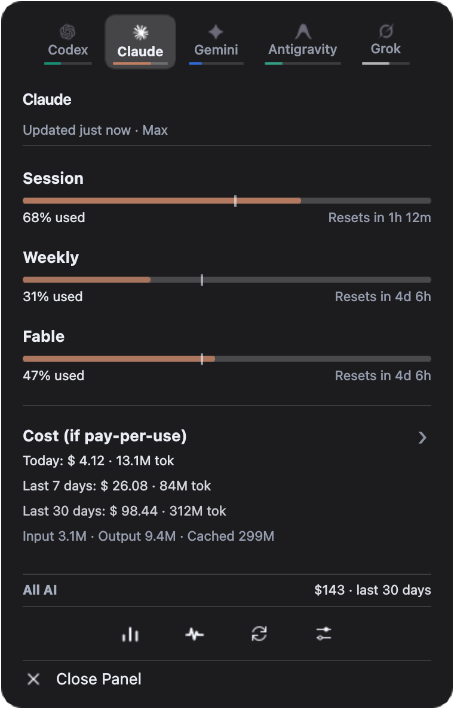
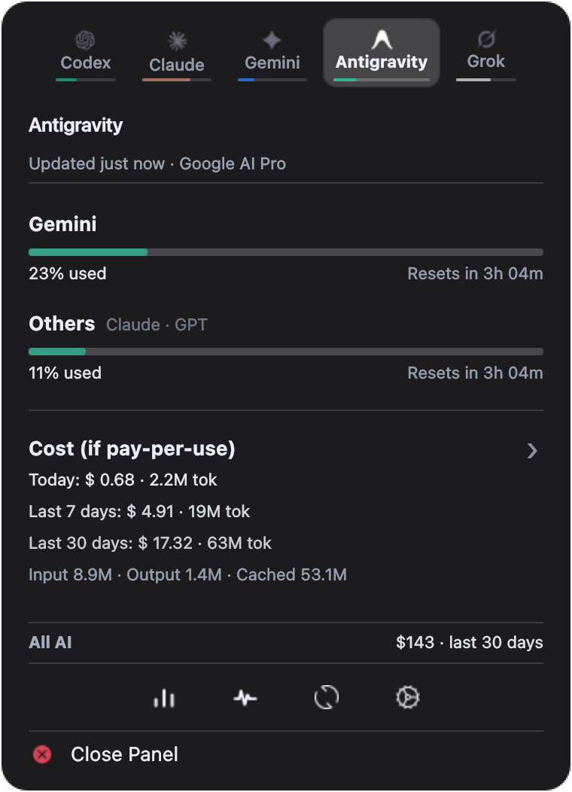

# TallyBar

A KDE Plasma 6 panel widget that shows how much of your AI coding assistants'
usage you have left — and what that usage would have cost at pay-per-use rates.

<p align="center">
  
  
</p>

## Why

Every AI coding tool meters you differently. Claude has a rolling session window
and weekly caps, plus separate ones for individual models; Codex has its own
session/weekly pair; Antigravity splits its quota between Gemini and everything
else; Grok bills by the week. Each hides that number behind a different CLI flag,
web page, or nothing at all — and none of them tell you what the tokens you just
burned would have cost on the API.

TallyBar puts all of it in the panel: one bar per limit, one number per bill.

## What it shows

| Provider        | Quota / limits                                    | Where that comes from                                                  |
|-----------------|---------------------------------------------------|------------------------------------------------------------------------|
| **Codex**       | session window, weekly window, plan               | the `codex` CLI's app-server over JSON-RPC; browser cookies as fallback |
| **Claude**      | session window, weekly window, per-model windows  | claude.ai, using your browser's existing session; plan read from disk   |
| **Gemini**      | daily usage, Google One AI credit pool            | gemini.google.com, using your browser's existing session                |
| **Antigravity** | Gemini window, Claude/GPT window, plan            | the local Antigravity language server, plus Google's Cloud Code API     |
| **Grok**        | weekly window                                     | the `grok` CLI's local session and log files                            |

Cost is computed separately, from **local log files only** — the transcripts
each CLI already writes to `~/.claude`, `~/.codex`, `~/.gemini`, `~/.grok` and
Antigravity's trajectory databases. Tokens are priced against the
[LiteLLM](https://github.com/BerriAI/litellm) model catalog (fetched once and
cached on disk), which is why the heading reads *"Cost (if pay-per-use)"* — it
is what your usage *would* have cost on the API, not what you were charged.

Clicking the cost row opens a separate chart window with a 7-day bar chart, a
month grid, a 24-hour histogram, and a per-model breakdown you can expand by
clicking a bar.

## Requirements

- **KDE Plasma 6.0** or newer
- **Python 3.11** or newer — the backend uses `asyncio.TaskGroup` and
  `asyncio.timeout`, both new in 3.11
- Nothing else. The backend is standard-library only: no pip install, no
  virtualenv, no daemon. (`.venv` in this repo is for running the tests.)

Optional, per provider: KWallet for decrypting Chromium-family cookies, and
whichever CLIs you actually use. Every provider is independent — a missing one
shows a status line, never an error dialog.

## Install

There is no tagged release yet, so install from source:

```bash
git clone https://github.com/DLANSAMA/TallyBarPlasmoid.git
cd TallyBarPlasmoid
make install
```

Then right-click your panel → **Add Widgets…** → search for *TallyBar*.

`make install` wraps `kpackagetool6`; if you would rather build the package and
install that — which is also what a future release asset will be — use:

```bash
make build
kpackagetool6 --type Plasma/Applet --install io.github.dlansama.tallybar.plasmoid
```

To update an existing install, `make upgrade`, then restart the shell so Plasma
drops its cached copy of the QML:

```bash
systemctl --user restart plasma-plasmashell.service
```

`make remove` uninstalls it.

## First run

The widget refreshes every 5 minutes by default and paints the last known values
immediately on cold start, so it is never blank while a fetch is in flight.

Each provider connects itself:

- **Codex** and **Grok** work as soon as their CLI has been used once — they are
  read straight off disk and the local app-server.
- **Antigravity** is read from its language server, which runs while Antigravity
  (or `agy`) is open. Plan and quota keep working from a cached token afterwards.
- **Claude** and **Gemini** use the session cookies already in your browser
  (Chrome, Chromium, Brave, Edge or Firefox). If you are signed in to claude.ai
  or gemini.google.com in one of those, there is nothing to configure; if you
  are not, the widget shows a **Sign in** button that opens the right page.

On a machine with none of these installed, the widget still starts and shows one
status line per provider (`No matching browser cookies`, `Grok Build data dir
(~/.grok) not found`, …) rather than failing.

## Configuration

The gear icon opens a settings flyout: refresh interval, which providers get a
tab, what the panel itself displays (percentage, cost or bars), notification
thresholds, per-provider mute, and an optional monthly budget.

Settings live in `~/.tallybar/config.json`. The rest of that directory is the
widget's own state — cached snapshot, the Antigravity token ledger, the monthly
cost archive, and parse caches. All of it is regenerable: delete it and the next
refresh rebuilds it.

## How it works

The widget is two halves separated by a process boundary:

```
QML frontend                       Python backend
io.github.dlansama.tallybar/contents/ui/      io.github.dlansama.tallybar/contents/code/
  main.qml  ── Plasma5Support ───►  backend.py --once --background
  (owns all state)  DataSource      (prints one JSON snapshot, exits)
        ▲                                   │
        └────────── stdout JSON ────────────┘
```

There is no daemon and no socket. Every refresh runs `backend.py` once; it
gathers everything concurrently, prints a single JSON document, and exits. The
frontend `JSON.parse`s stdout and re-renders. That shape is deliberate — a
widget that can't hang is worth more than one that saves a process spawn, and it
makes the backend trivially testable and debuggable by hand:

```bash
# Exactly what the widget runs, but readable
python3 io.github.dlansama.tallybar/contents/code/backend.py --once --pretty

# Skip every remote call (local logs and language servers only)
python3 io.github.dlansama.tallybar/contents/code/backend.py --once --no-network --pretty

# Just the cost/token numbers
python3 io.github.dlansama.tallybar/contents/code/backend.py --cost
```

`backend.py` always prints parseable JSON, including on a fatal error — it falls
back to the last cached snapshot rather than exiting silently, because a crash
that prints nothing would blank the widget.

The contracts a change must not break — and the test that guards each one — are
in [`CLAUDE.md`](CLAUDE.md).

## Privacy and security

This widget reads credentials, so it is worth being explicit about what it does
with them:

- **Nothing is sent anywhere but the provider it belongs to.** There is no
  telemetry, no analytics, no update check. The only hosts contacted are the
  ones in the table above plus `raw.githubusercontent.com` for the price catalog.
- **Browser cookies are read, never kept.** The browser's own database is never
  opened directly (that would fight the browser for the lock). It is copied into
  a private `0700` directory under `$XDG_RUNTIME_DIR` — tmpfs, cleared at logout
  — with `O_NOFOLLOW`, read once, and deleted. Copies stranded by a killed
  process are swept on the next run.
- **Chromium-family cookies are decrypted through KWallet**, using the same
  key the browser itself uses. TallyBar never asks you for a password, and the
  background refresh never triggers a wallet-unlock prompt.
- **Every diagnostic string is scrubbed** for tokens, API keys, JWTs and session
  cookies before it can reach the snapshot, the UI, or a log.
- **Everything written to disk is written atomically at `0600`** under a `0700`
  parent — temp file, `fsync`, `os.replace` — and the files that matter carry a
  `.bak` mirror with corruption quarantine on load.
- **Credentialed requests refuse redirects.** CPython's redirect handler copies
  the `Authorization` header cross-origin; the Google endpoints that receive a
  bearer token never legitimately redirect, so a `3xx` from one is treated as an
  attack and raised instead of followed.
- **Refreshes stop while the screen is locked**, and do not overwrite the cached
  snapshot when they do.

## Development

```bash
python3 -m venv .venv && .venv/bin/pip install -r requirements.txt

make test         # 530 tests
make lint         # pyflakes (what CI runs)
make check        # flake8 + Qt6 qmllint (fails on QML errors) + mypy
make preview      # load a UI component in a standalone window, no Plasma needed
make screenshots  # re-render docs/screenshots/ offscreen from a mock fixture
make build        # package io.github.dlansama.tallybar.plasmoid
```

### Adding a provider

TallyBar can't support a provider until someone has seen what it actually
returns, and no maintainer holds a subscription to every AI coding tool. So
captures are cheap to produce and worth contributing:

```bash
python3 tools/capture_provider.py copilot     # or: cursor
```

It reads the credential that tool already stored locally, makes one request,
scrubs the response through the same `scrub_credentials` the backend uses, and
writes a `0600` file. It uploads nothing. Free tiers are enough — GitHub Copilot
Free and Cursor's Hobby plan both yield a real response shape, which is the part
that can't be guessed.

Scrubbing is best-effort: read the file before attaching it to an issue.

The arithmetic lives in modules that don't reach the network — `parsers.py` is
pure (payload in, limit rows out) and `accounting.py` does token and cost maths
against local files only. That is what most of the test suite exercises. The UI
can be run without Plasma — see
[`tools/preview/README.md`](tools/preview/README.md).

CI runs the lint and the tests on every pull request and every push to `main`;
pushing a `v*` tag builds the `.plasmoid`, stamps the version into
`metadata.json`, and attaches the package to a GitHub release.

## Known limitations

- **Linux/KDE only.** It is a Plasma 6 applet; there is no port to anything else.
- **The Claude and Gemini readings depend on unofficial endpoints** — the same
  ones their web UIs call, with your own session. They are not public APIs and
  can change without notice. When one does, that provider degrades to a status
  message and the others keep working.
- **Grok has no live quota.** The xAI CLI stores none locally and the console
  API has not been wired up, so Grok shows local token history and a weekly bar
  derived from it.
- **Costs are estimates.** They are list prices applied to locally logged token
  counts. Treat them as a sense of scale, not a bill.
- **Not released yet.** There is no tag and nothing on the KDE Store; install
  from source for now. [`CHANGELOG.md`](CHANGELOG.md) tracks what the first
  release will contain.

## Prior art

The idea comes from [CodexBar](https://github.com/steipete/CodexBar) by Peter
Steinberger — the same job, done as a macOS menu-bar app. TallyBar is an
independent implementation for Plasma with its own backend, and it borrows
CodexBar's monochrome provider marks under that project's MIT license.

## License

MIT — see [LICENSE](LICENSE). Provider logos are the trademarks of their
respective owners and are bundled only to identify each provider; the bundled
MIT-licensed artwork carries its upstream copyright notice. Both are recorded in
[`io.github.dlansama.tallybar/NOTICE`](io.github.dlansama.tallybar/NOTICE).
